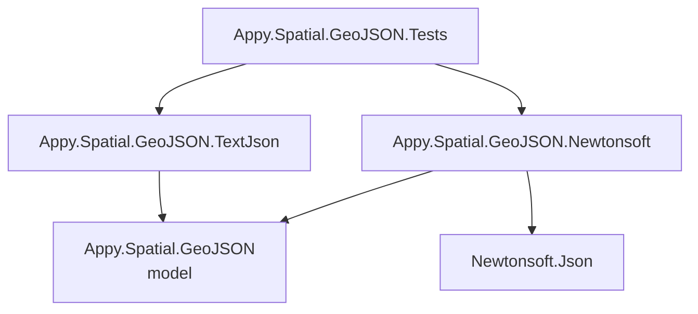

# Appy.Spatial.GeoJSON Architecture

## Overview

A small library: plain GeoJSON model classes in `Appy.Spatial.GeoJSON`, and two converter packages
that teach Newtonsoft.Json and System.Text.Json how to read polymorphic geometries and features.
The model has no serializer dependency, so consumers pick one converter package.

Build, test and conventions: [AGENTS.md](../AGENTS.md).

## System Diagram

## Key Patterns

### Type discriminator

Geometries derive from `Geometry` / `Geometry<TCoordinates>` and features from `Feature`,
`Feature<TGeometry>` and `Feature<TGeometry, TProperties>`. The converters handle only the abstract
`Geometry` and `Feature` targets: they read the GeoJSON `type` property first (the geometry's
`type` for features), then deserialize into the concrete class (`Point`, `LineString`, `Polygon`, `MultiLineString`,
`MultiPolygon`, `GeometryCollection`). Unknown types throw the serializer's JSON exception.

### Opt-in registration

Each converter package exposes one extension, `UseGeoJsonConverters()`, on `JsonSerializerSettings`
(Newtonsoft) or `JsonSerializerOptions` (System.Text.Json). It adds `FeatureConverter` and
`GeometryConverter`.

## CI and Release

| Workflow | Trigger | Does |
|----------|---------|------|
| `.github/workflows/ci.yaml` | pull request | `dotnet cake` on Windows and macOS, then Linux |
| `.github/workflows/publish.yaml` | push to `master` touching `src/**`, or any tag | `dotnet cake --target=Publish`: packs, pushes to nuget.org and GitHub Packages |

MinVer computes the version from the latest tag: a tag publishes that release, and a `master` push
publishes a `-preview` build with the commit height.

## Plans

| Plan | Status | Summary |
|------|--------|---------|
| [001 .NET 10 Migration](plans/001-net10-migration.md) | Planned | `net10.0;net9.0;net8.0`, SDK 10, Cake 6, xUnit v3; release 2.0.0 |
